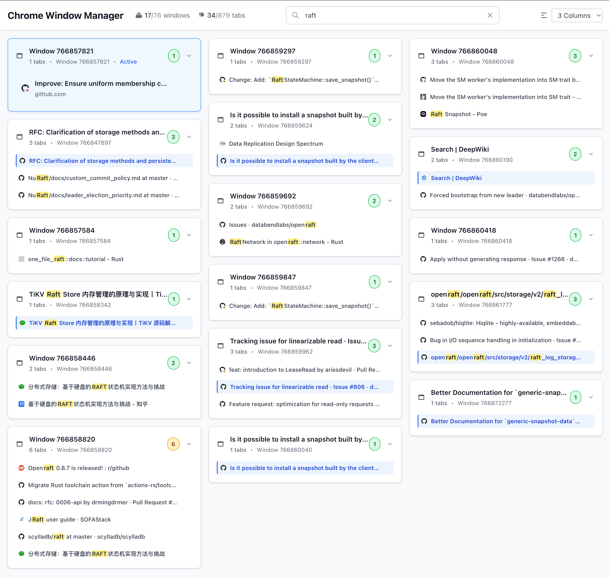

# Chrome Window Manager

A modern Chrome extension that helps you easily manage and browse all Chrome windows and tabs.

## Features

- 🖥️ **Window Management** - View all open Chrome windows and tabs
- 🔍 **Smart Search** - Real-time search through tab titles and URLs with highlighted matches
- 📊 **Column Control** - Customize display columns (1-6 columns) or auto-adapt to screen
- 🎯 **Quick Switch** - Click any tab to instantly jump to it
- ❌ **Tab Management** - One-click close unwanted tabs
- 🌙 **Incognito Support** - Clear identification of incognito windows
- 📌 **Pinned Tab Indicator** - Display pinned tab status
- 🎨 **Waterfall Layout** - Responsive card layout for maximum space utilization

## Screenshot



*The extension interface showing search functionality with highlighted results, waterfall card layout, and organized window management*

## Installation

### Install from Source

1. **Download Project**
   ```bash
   git clone <repository-url>
   cd chrome-winmgr
   ```

2. **Install Dependencies and Build**
   ```bash
   npm install
   npm run build
   ```

3. **Load into Chrome**
   - Open Chrome and go to `chrome://extensions/`
   - Enable "Developer mode"
   - Click "Load unpacked"
   - Select the project's `dist` directory

### How to Use

1. After installation, click the extension icon in Chrome toolbar
2. The extension opens a full-page window management interface in a new tab
3. Use the search bar at the top to quickly find specific tabs
4. Adjust column display to fit your screen and usage preferences
5. Click tabs to jump quickly, click close button to close tabs

## Interface Guide

- **Top Header** - Shows window/tab statistics, search bar, and column selector
- **Active Window** - Current focused window is highlighted and shown first
- **Search Function** - Enter keywords to filter tabs in real-time with highlighted matches
- **Responsive Layout** - Auto-adjusts columns based on screen size, or manually select fixed columns

## Changelog

### v2.0.0 (Current Version)
- ✨ Added search functionality with real-time search and text highlighting
- ✨ Added column control supporting 1-6 custom columns
- 🎨 Adopted waterfall card layout for optimized space utilization
- 🚀 Complete rewrite with modern React interface
- ⚡ Removed unnecessary permissions for improved performance and security
- 🎯 Focus on core features for a cleaner user experience

## License

MIT License
